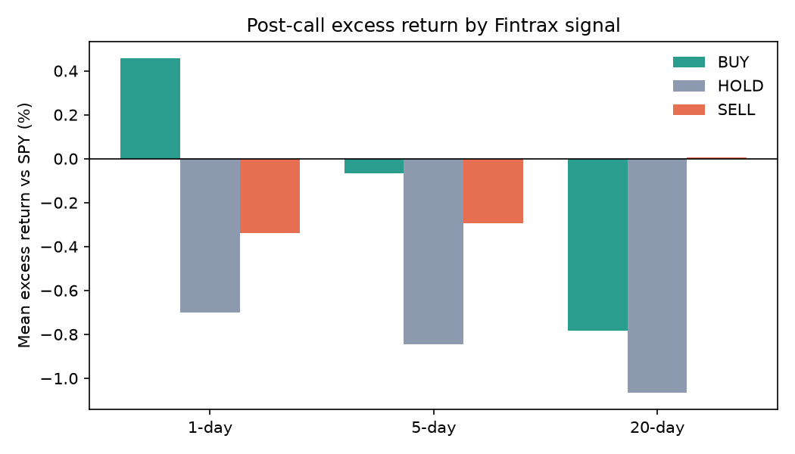

# Fintrax

**How confident does management sound when the script ends?**

Fintrax scrapes earnings-call transcripts from The Motley Fool and splits each call into **prepared remarks** and **Q&A**. A **FinBERT** model fine-tuned on management sentences scores each one as **low / neutral / high confidence**. The gap between scripted and unscripted confidence becomes a **BUY / HOLD / SELL** signal. A long-only inventory trades on those signals and is compared against putting the same dollars into SPY.

> **Status (Oct 2026):** the full-archive run is in progress. The scraper has found **53,642 transcript URLs** (2017 → today) in fool.com's sitemaps and is downloading them. Retraining, scoring and the backtest run automatically after that. This README describes the current pipeline. The only results so far are from the [202-call pilot](#pilot-results-202-calls), which used an older fixed-holding-period backtest, and will be replaced when the full run finishes.

```mermaid
flowchart LR
    A[fool.com monthly sitemaps<br/>53k transcript URLs] -->|scrape.py| B[gzipped transcript pages]
    B -->|parse.py| C[speaker turns<br/>prepared vs Q&A]
    C -->|dataset.py + lexicon.py| D[management sentences<br/>+ Loughran-McDonald weak labels]
    D -->|train.py| E[FinBERT<br/>low / neutral / high]
    E -->|score.py| F[per-call confidence<br/>prepared, Q&A, gap]
    F -->|signals.py| G[BUY / HOLD / SELL]
    G -->|inventory.py| H[long-only inventory<br/>vs same dollars in SPY]
```



## Pipeline

### 1. Scrape — `fintrax/scrape.py`
- **Discovery:** every `/earnings/call-transcripts/` URL in fool.com's public monthly sitemaps, which `robots.txt` advertises, from 2017 to now.
- **Metadata from the page:** older URLs are truncated `.aspx` slugs with no ticker, so the ticker, company and fiscal quarter are read from each page (`<meta name="primary_tickers">` and the title).
- **Politeness:** 1.5 requests/s shared across 3 threads, backing off if the site starts throttling.
- **Resumable storage:** each URL gets one line in `data/raw/index.jsonl`. Only the gzipped transcript body is kept, about 20 KB per call instead of about 500 KB.

### 2. Parse and split — `fintrax/parse.py`
Motley Fool has used three page layouts, and the parser handles all of them:

| Era | Date location | Prepared vs Q&A boundary |
|---|---|---|
| 2017–18 | header paragraph ("Feb. 8, 2018, 9:00 a.m. ET") | `Prepared Remarks:` / `Questions & Answers:` headers |
| ~2019–25 | `#date` span | same headers, `Name -- Role` speaker lines |
| 2025+ | `DATE` section | no header: Q&A starts at the hand-off turn before the first analyst who follows a strict Q&A cue ("first question", "[Operator Instructions]", …) |

- **Call date:** comes from the page, not the URL, because the URL date is the *publish* date. It lags the call by days, and by years for republished transcripts.
- **Roles:** investor-relations hosts missing from the participant list, and executives whose names don't match the list ("Jen-Hsun" vs "Jensen" Huang), are still classified as management.
- **Duplicates:** republished duplicates of the same call are dropped.
- **Dropped calls:** anything with fewer than 500 management words in either section. These are mostly calls with no Q&A, or pages where Fool merged answers into analyst turns.
- **Only executives are scored.** Analysts, operators and safe-harbor boilerplate are excluded.

### 3. Weak labels — `fintrax/lexicon.py`, `fintrax/dataset.py`
There's no labeled dataset of earnings-call confidence, so labels come from the [Loughran-McDonald](https://sraf.nd.edu/loughranmcdonald-master-dictionary/) word lists plus spoken-language phrases. The dictionary is academic-use only, so it's downloaded at runtime and not committed.

| Cue type | Examples | Weight |
|---|---|---|
| LM strong modal | *definitely, clearly, never, always* | +1 (*will* +0.5) |
| Certainty phrases | *confident, on track, committed to, clear line of sight* | +1 |
| LM weak modal + uncertainty | *may, might, could, perhaps, depend* | −1 |
| LM moderate modal | *likely, probably, should, would* | −0.5 |
| Hedge phrases | *too early to tell, hard to say, kind of, we'll see* | −1 |
| Soft hedges | *I think, we believe* | −0.5 |

How sentences are labeled:
- **high** if the net score is ≥ 1, **low** if ≤ −1, and **neutral** with no cues at all.
- Mixed sentences are left out of training. Approximators like *nearly 600,000* aren't counted as hedges.

The training sample has up to **860k sentences** drawn from every call and class-balanced. Train, validation and test are split 70/15/15 **by call** (hashed, so the split stays stable as calls are added).

### 4. Fine-tune FinBERT — `fintrax/train.py`
- **Model:** [`ProsusAI/finbert`](https://huggingface.co/ProsusAI/finbert) with a fresh 3-way head and class-weighted loss.
- **Training:** 1 epoch, lr 3e-5, batch size 64, bf16, with batches grouped by sentence length. That runs at about 150–180 sentences/s on an Apple M5 (MPS).
- **Test score:** accuracy against the weak labels on held-out calls.
- **Context check:** every lexicon cue is deleted from the test sentences, and P(high) − P(low) must still rank low vs. high (AUC above 0.5). This checks whether the model learned anything beyond the word lists.

### 5. Score calls — `fintrax/score.py`
- Each management sentence gets the confidence index **P(high) − P(low)** ∈ [−1, 1], scored in fp16 at about 1,000–1,400 sentences/s. Scoring resumes where it left off if interrupted.
- Per call it computes `conf_prepared`, `conf_qna`, **`gap = conf_qna − conf_prepared`**, and the change in Q&A confidence from the company's previous call.
- FinBERT's own positive/negative sentiment is optional (`score.sentiment`). It doubles scoring time.

### 6. Signals — `fintrax/signals.py`
Management is nearly always less confident in Q&A (the gap is negative on ~94% of calls), so signals are **relative**. Each call's gap and Q&A confidence are z-scored against **every call held before it**, so there's no look-ahead.

| Signal | Rule (`config.yaml`) | Meaning |
|---|---|---|
| **BUY** | `gap_z > 0.5` and `conf_qna_z > 0` | Management holds up better than usual off-script |
| **SELL** | `gap_z < −0.5` or `conf_qna_z < −1` | Confidence collapses under questioning |
| **HOLD** | otherwise | |

### 7. Inventory backtest — `fintrax/inventory.py`, `fintrax/backtest.py`
**There's no fixed holding period: the signals manage an inventory.** Each call's signal acts at the first market open after the call ends. For a pre-market call that's the same morning; otherwise it's the next trading day.

| Signal | What the model does |
|---|---|
| **BUY** | Buys one **$1,000 lot**, up to **5 lots** per stock. A BUY at the cap is skipped. |
| **SELL** | **Sells the entire position** in that stock. It's long-only, so a SELL with nothing held does nothing. |
| **HOLD** | Keeps what it holds. |

- **How long a position lasts:** it stays open until a later call's SELL takes it out, or the stock's price history ends (delisting, acquisition), in which case it closes at the last close.
- **Benchmark:** every lot is mirrored by a **shadow SPY lot** bought and sold on the same days with the same dollars. "Excess" means versus putting that money into the index instead.
- **Filters:** stocks under $5 or trading under $1M/day are skipped.

Outputs in `results/`:

| File | Contents |
|---|---|
| `trades.csv.gz` | every BUY, SELL, skipped signal and HOLD, with shares, price, realized P&L, SPY P&L and days held |
| `inventory.csv` | what the model holds now: lots, cost basis, market value, unrealized P&L |
| `book_daily.csv.gz` | daily mark-to-market of the inventory and its SPY shadow |
| `backtest.json` | totals, return stats (annualized, Sharpe, drawdown), year by year, and signal diagnostics |
| `signals.csv` | every call's confidence scores and signal |

**Signal diagnostics.** These are separate from the strategy: the excess return after each signal at fixed 1/5/20/60-day horizons, with t-stats clustered by month (calls in one earnings season aren't independent). Confidence quintiles ranked within each calendar quarter judge the earlier years without any thresholds.

### Charts — `fintrax/charts.py`
| Figure | What it shows |
|---|---|
| `trades/{TICKER}.png`, `trade_signals_grid.png` | Price with a **green ▲ for each buy** and a **red ▼ for each sell** (labeled with that exit's return). Hollow markers are signals that couldn't trade. The background is green while held, darker with more lots, with a lots-held panel below. |
| `equity_curve.png` | Inventory P&L vs the same dollars in SPY, growth of $1, capital deployed and stocks held |
| `by_year.png` | Inventory vs SPY shadow return, year by year |
| `latest_picks.png` | Strongest BUY and SELL signals from the most recent calls |
| `excess_by_signal.png`, `confidence_quintiles.png` | Signal diagnostics |

## Pilot results (202 calls)
<a id="pilot-results-202-calls"></a>The first version ran on 30 large-cap tickers × ~8 quarters (Apr 2024 – Oct 2026) with a **fixed** 1/5/20-day hold. Files are in [`results/pilot/`](results/pilot/).

| | |
|---|---|
| Classifier | 99.1% test accuracy / 0.991 macro-F1 against the weak labels (majority baseline 42.9%). Mostly the model reproducing the lexicon. |
| Beyond the lexicon | With every cue deleted, the model still ranks low vs high at **AUC 0.67** |
| Main finding | Management was less confident in Q&A than in prepared remarks on **94.6%** of calls. Hedging sentences rose from 12% to 31%. |
| Trading signal | 1-day BUY − SELL spread +0.80%, **not significant** (t = 1.48, p = 0.14). No edge at 5 or 20 days. |



182 traded calls were too few to detect a modest effect, which is why the pipeline now covers the whole archive.

## Limitations
- **Weak labels.** "Confidence" here means certainty language as defined by a lexicon, not management's actual confidence, and the model mostly reproduces it.
- **Survivorship bias.** Prices come from Yahoo Finance, which lacks many delisted tickers, so calls from companies that later disappeared drop out of the backtest.
- **No transaction costs** or slippage in the inventory P&L.
- **Pooled comparison.** Every company is z-scored against every other company's past calls. Speaking styles differ (e.g. MCD vs JNJ), so per-company baselines would be fairer.
- **Transcript quality.** Fool's transcripts are machine-assisted. Calls with merged or unlabeled speakers are dropped when a section ends up too short.

## Reproduce

```sh
make setup                 # python3 -m venv .venv && pip install -r requirements.txt
make scrape                # ~10 h for the full archive at 1.5 req/s; resumable
make parse label train     # train ~1 h on Apple Silicon (MPS) or a GPU
make score                 # ~4 h fp16 for ~14M sentences; resumable
make signals backtest      # first run downloads prices for every ticker (cached in data/prices)
make test                  # 30 tests: parser layouts, weak labels, signals, backtest + inventory
```

Or run `python -m fintrax all`. All settings live in [`config.yaml`](config.yaml).

**Data and licensing:** transcripts are © The Motley Fool and the Loughran-McDonald dictionary is free for academic use only, so neither is committed. `data/` and `models/` are gitignored, and the tests use small synthetic fixtures.

*Research project, not investment advice.*
