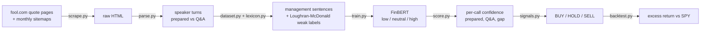
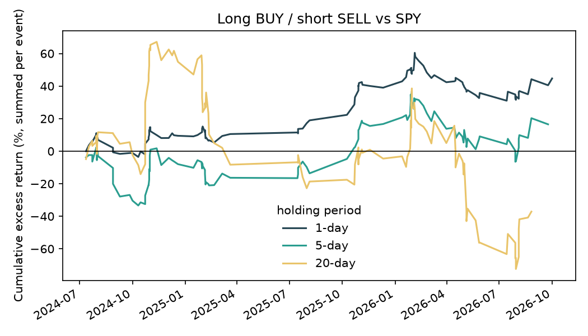

# Fintrax

**How confident does management sound when the script ends?**

Fintrax scrapes earnings-call transcripts from The Motley Fool and splits each call into **prepared remarks** and **Q&A**. A **FinBERT** model fine-tuned on the management sentences scores each one as **low / neutral / high confidence**. The gap between scripted and unscripted confidence then becomes a **BUY / HOLD / SELL** signal, which is backtested against SPY.



## Headline results

| | |
|---|---|
| Calls | **202** usable calls, 30 large-cap tickers, Apr 2024 – Oct 2026 (214 scraped) |
| Sentences | **70,400** management sentences scored (30,793 prepared remarks, 39,607 Q&A answers) |
| Classifier | **99.1%** test accuracy / **0.991** macro-F1 against the weak labels (majority baseline: 42.9%) |
| Beyond the lexicon | With every lexicon cue deleted, the model still ranks low vs high at **AUC 0.67** (0.5 = no signal) |
| Main finding | Management is less confident in Q&A than in prepared remarks on **94.6%** of calls (mean confidence +0.01 → −0.19) |
| Trading signal | 1-day BUY − SELL spread is **+0.80%** but **not significant** (t = 1.48, p = 0.14). No edge at 5 or 20 days |

The language finding is robust. The trading signal is not, at least on this sample: see [Backtest](#backtest) and [Limitations](#limitations).

## Pipeline

### 1. Scrape — `fintrax/scrape.py`
- **Finding transcripts:** transcript URLs come from each ticker's fool.com quote page (`/quote/{exchange}/{ticker}/`). The monthly sitemaps that `robots.txt` advertises fill in the gaps.
- **Selection:** the newest 8 fiscal quarters per ticker are kept. Rate is about one request per 3–4 s, and every page is cached so a re-run fetches nothing twice.
- **Dates:** fool.com URLs carry the *publish* date. It lags the call by days, and by years for republished transcripts (e.g. Intel's Q3 2024 call lives at a 2026/04/22 URL). Files are therefore keyed by ticker + fiscal quarter, and the real call date and time are read from the page.

### 2. Parse and split — `fintrax/parse.py`
Motley Fool uses two layouts, and the parser handles both:

- **Legacy:** explicit `Prepared Remarks:` / `Questions & Answers:` headers, with each speaker line written as `Name -- Role`.
- **Current:** a `Role — Name` participant list at the top, then `Name: text` turns with **no Q&A header**. The Q&A boundary is the short hand-off turn (e.g. "Our first question comes from…") just before the first analyst who follows a strict Q&A cue.

The parser also handles these tricky cases:
- Investor-relations hosts missing from the participant list.
- Executives whose names don't match the list ("Jen-Hsun" vs "Jensen" Huang).
- Bolded sentences that look like speaker labels.
- Tesla- and Netflix-style formats where a host reads out the questions.

Calls with < 500 management words in either section are dropped (12 of 214). For example, PepsiCo publishes its prepared remarks separately and opens the call with Q&A.

**Only executives are scored.** Analysts' questions and operator lines are excluded, and so is safe-harbor boilerplate ("forward-looking statements…").

### 3. Weak labels — `fintrax/lexicon.py`, `fintrax/dataset.py`
There's no labeled "confidence" dataset for earnings calls, so labels come from the [Loughran-McDonald](https://sraf.nd.edu/loughranmcdonald-master-dictionary/) finance word lists, extended with phrases common in spoken calls. The LM dictionary is downloaded at runtime and never committed.

| Cue type | Examples | Weight |
|---|---|---|
| LM strong modal | *definitely, clearly, never, always* | +1 (*will* +0.5) |
| Certainty phrases | *confident, on track, committed to, clear line of sight, no doubt* | +1 |
| LM weak modal + uncertainty | *may, might, could, perhaps, uncertain, depend* | −1 |
| LM moderate modal | *likely, probably, should, would* | −0.5 |
| Hedge phrases | *too early to tell, hard to say, kind of, it depends, we'll see* | −1 |
| Soft hedges | *I think, we believe* | −0.5 |

How a sentence is labeled:
- **high** if the net score is ≥ 1, and **low** if it's ≤ −1.
- **neutral** if it has no cues at all.
- Mixed or weak cues are left out of training (11k sentences). Neutral is downsampled to balance the classes.
- Approximators like *nearly 600,000* are not counted as hedges.

The split is 70/15/15 **by call**, so no call's sentences appear in two splits: 12,986 train / 2,612 val / 3,015 test sentences, from 141 / 30 / 31 calls.

### 4. Fine-tune FinBERT — `fintrax/train.py`
- **Model:** [`ProsusAI/finbert`](https://huggingface.co/ProsusAI/finbert) with a freshly initialized 3-way head.
- **Training:** class-weighted cross-entropy, lr 2e-5, 3 epochs, max length 128.
- **Hardware and time:** about 17 minutes on an Apple M5 (MPS).

| Test set (31 held-out calls) | Precision | Recall | F1 |
|---|---|---|---|
| low | 0.994 | 0.992 | 0.993 |
| neutral | 0.992 | 0.987 | 0.989 |
| high | 0.986 | 0.996 | 0.991 |

**Read this honestly:** 99% accuracy mostly shows that FinBERT can reproduce the lexicon. The useful question is whether it learned anything *beyond* the lexicon. `context_check` answers that by deleting every lexicon cue from the test set's low and high sentences and asking whether P(high) − P(low) still orders them:

- The AUC is **0.67**, so some confidence signal comes from context and not just the cue words.
- On stripped text, though, the model calls 96% of sentences neutral. It is still mostly a smoothed, context-aware version of the lexicon.

### 5. Score calls — `fintrax/score.py`
Each management sentence gets the confidence index **P(high) − P(low)** ∈ [−1, 1] and FinBERT's original sentiment, P(pos) − P(neg). These are averaged per call and section:

- `conf_prepared` and `conf_qna`
- **`gap = conf_qna − conf_prepared`**
- `delta_qoq`: the change in Q&A confidence from the company's previous call

| Share of sentences | low | neutral | high |
|---|---|---|---|
| Prepared remarks | 11.8% | 76.3% | 11.9% |
| Q&A answers | **30.9%** | 57.8% | 11.4% |

High-confidence language holds steady, but hedging nearly triples once analysts start asking questions. The gap is negative on 94.6% of calls. Average gap by company runs from about −0.40 (MCD, COST, XOM) to near zero (JNJ, NFLX). PEP is the one positive average, and it's a special case because its prepared remarks are mostly published separately.

### 6. Signals — `fintrax/signals.py`
Because almost every call has a negative gap, the signal uses a **relative** measure: how this call's gap and Q&A confidence compare with every call held **before it**. These are expanding-window z-scores, so there's no look-ahead, and the first 20 calls are warm-up.

| Signal | Rule (thresholds in `config.yaml`) | Intuition | Calls |
|---|---|---|---|
| **BUY** | `gap_z > 0.5` and `conf_qna_z > 0` | Management holds up better than usual off-script | 48 |
| **SELL** | `gap_z < −0.5` or `conf_qna_z < −1` | Confidence collapses under questioning | 67 |
| **HOLD** | otherwise | | 67 |

The latest signals are in [`results/signals.csv`](results/signals.csv). For example, the Sept 2026 COST call scored `gap_z = −3.2` → SELL, and the Oct 2026 NKE call `conf_qna_z = +2.1` → BUY.

### 7. Backtest
<a id="backtest"></a>`fintrax/backtest.py` enters at the first market open after the call: the same day for pre-market calls, otherwise the next trading day. It measures the stock's return minus SPY's over 1, 5 and 20 trading days.

| Horizon | BUY (n) | HOLD (n) | SELL (n) | BUY − SELL | t | p | Hit rate BUY / SELL |
|---|---|---|---|---|---|---|---|
| 1 day | +0.46% (48) | −0.70% (67) | −0.34% (67) | **+0.80%** | 1.48 | 0.14 | 56% / 57% |
| 5 days | −0.07% (47) | −0.85% (67) | −0.29% (67) | +0.23% | 0.24 | 0.81 | 47% / 52% |
| 20 days | −0.78% (47) | −1.07% (66) | +0.01% (66) | −0.79% | −0.47 | 0.64 | 38% / 56% |

Threshold-free check: Spearman rank correlation of each raw feature with the excess return. None is significant.

| Horizon | gap | conf_qna | conf_prepared | sentiment_qna |
|---|---|---|---|---|
| 1 day | +0.057 (p=0.44) | +0.013 (p=0.86) | −0.112 (p=0.13) | +0.088 (p=0.24) |
| 5 days | −0.005 (p=0.95) | −0.061 (p=0.42) | −0.112 (p=0.13) | +0.056 (p=0.45) |
| 20 days | −0.069 (p=0.36) | −0.121 (p=0.11) | −0.083 (p=0.27) | +0.053 (p=0.48) |

The 1-day results point the expected way (BUY outperforms SELL), but on 182 calls the effect is not statistically distinguishable from zero, and it doesn't persist. The thresholds were set before running the backtest and haven't been tuned on it.




## Limitations
- **Small sample.** 202 calls from 30 mega-caps over ~2.5 years is too few to detect a modest effect, and the calls cluster in earnings seasons, so they aren't independent.
- **Weak labels.** "Confidence" here means certainty language as defined by a lexicon. That isn't the same as management's actual confidence, and the model mostly reproduces it (see the context check). Spoken-language quirks leak in: for example, *will* in "that 17 billion will grow" reads as certainty.
- **Cross-company comparisons.** Speaking styles differ a lot (MCD vs JNJ). A per-company baseline, e.g. `delta_qoq` with longer histories, would be a fairer comparison than the pooled z-score.
- **Transcript quality.** Fool's transcripts are machine-assisted. A few calls mislabel or merge speakers, and those are dropped when a section ends up too short.
- **The model scores sentences, not prices.** It never saw returns, so there's no return leakage between training and backtest calls. The only thing fit on the full sample is the weak-label rules.

## Reproduce

```sh
make setup                # python3 -m venv .venv && pip install -r requirements.txt
make scrape               # ~15 min, polite rate limit; cached in data/raw (gitignored)
make parse label train    # train ~17 min on Apple Silicon (MPS) or a GPU
make score signals backtest
make test                 # 18 tests: parser layouts, weak labels, signal rules / look-ahead
```

Or run `python -m fintrax all`. All parameters live in [`config.yaml`](config.yaml).

**Data and licensing:** transcripts are © The Motley Fool and the Loughran-McDonald dictionary is free for academic use only, so neither is committed. `data/` and `models/` are gitignored, and the tests use small synthetic fixtures.

*Research project, not investment advice.*
