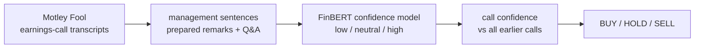
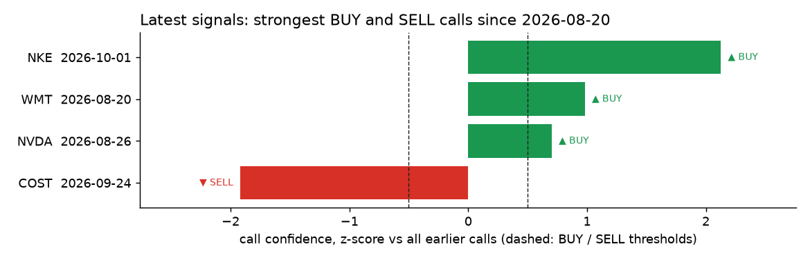
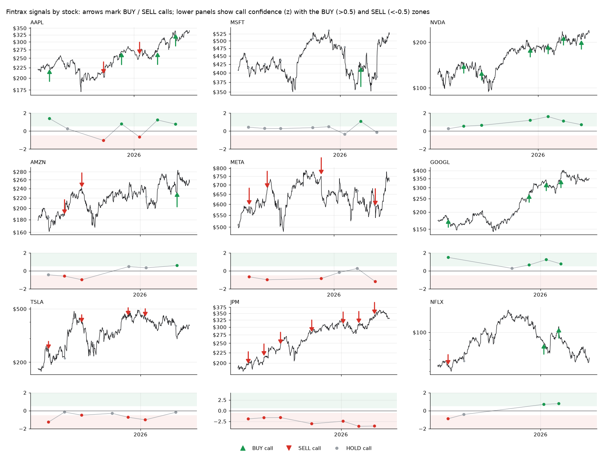
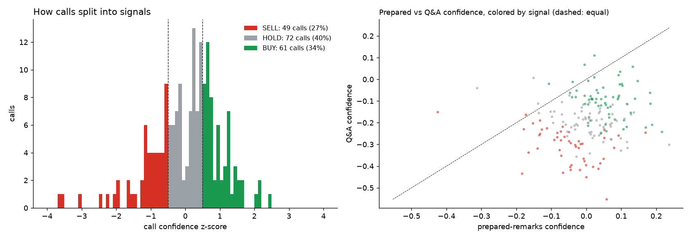
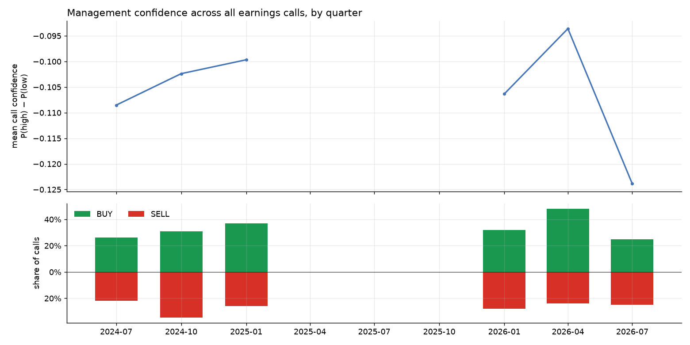

# Fintrax

**A confidence model for earnings calls, and the trading signals it produces.**

Fintrax reads earnings-call transcripts from The Motley Fool and uses a fine-tuned **FinBERT** to score how confident management sounds, sentence by sentence. Each call's confidence is compared with every call before it. A call that sounds clearly more confident than usual is a **BUY**, clearly less confident is a **SELL**, and anything in between is a **HOLD**.

> **Status (Oct 2026):** the full-archive run is in progress. **53,642 transcripts** (2017 → today) are being downloaded, after which the model is retrained and every call is scored automatically. The figures below come from the **202-call pilot** (30 large caps, 2024–26) and will be replaced by full-archive versions.



## The signal

**`results/signals.csv`** has one row per call. This is the product.

| Column | Meaning |
|---|---|
| `signal` | **BUY / HOLD / SELL** |
| `confidence` | Mean P(high) − P(low) over every management sentence, from −1 (all hedging) to +1 (all certainty) |
| `confidence_z` | How that compares with every earlier call, in standard deviations. **This drives the signal.** |
| `conf_prepared`, `conf_qna` | Confidence in the scripted remarks and in the unscripted Q&A |
| `gap` | Q&A minus prepared confidence: how much the tone drops off-script (context only) |
| `pct_high`, `pct_low` | Share of sentences the model calls high- and low-confidence |
| `confidence_change` | Change from the company's previous call |

**Rules** (`config.yaml → signals`):

| Signal | When | Reading |
|---|---|---|
| **BUY** | `confidence_z > +0.5` | Management sounds clearly more certain than calls usually do |
| **SELL** | `confidence_z < −0.5` | Management is hedging more than usual |
| **HOLD** | in between | Nothing unusual |

The z-score uses only calls dated **before** the one being scored, so a signal never uses future information. The first 20 calls are warm-up.

**`results/latest_signals.csv`** lists the strongest BUY and SELL calls from the last 45 days:



### Signals by stock
Each chart has two panels. On top, the price is shown for context, with a **green ▲ at every BUY call** and a **red ▼ at every SELL call**. Below, each call's confidence z-score is plotted against the shaded BUY and SELL zones (`results/signal_charts/{TICKER}.png`, `signal_grid.png`).



Some companies sound consistently more or less confident than others. In the pilot, NVDA's calls were nearly all BUY and JPM's nearly all SELL. The signal compares each call with *all* earlier calls, not with the company's own history, so `confidence_change` is the column to check for a shift within one company.

### Confidence across the market
`confidence_distribution.png` shows how calls split into signals and plots prepared vs Q&A confidence, colored by signal:



`confidence_index.png` tracks average management confidence across all calls, quarter by quarter, alongside the share of BUY and SELL signals each quarter:



Nearly every call scores **lower in Q&A than in its prepared remarks**: points fall below the dashed line in the scatter. In the pilot, the share of hedging sentences rose from 12% in prepared remarks to 31% in Q&A.

## The confidence model
- **Training data:** management sentences from every call. Analysts, operators and safe-harbor boilerplate are removed.
- **Labels:** there's no labeled dataset of earnings-call confidence, so the training labels come from the [Loughran-McDonald](https://sraf.nd.edu/loughranmcdonald-master-dictionary/) finance word lists plus spoken hedges and certainty phrases. That dictionary is academic-use only, so it's downloaded at runtime and never committed.

| Cue type | Examples | Weight |
|---|---|---|
| Strong modal | *definitely, clearly, never, always* | +1 (*will* +0.5) |
| Certainty phrases | *confident, on track, committed to, clear line of sight* | +1 |
| Weak modal + uncertainty | *may, might, could, perhaps, depend* | −1 |
| Moderate modal | *likely, probably, should, would* | −0.5 |
| Hedge phrases | *too early to tell, hard to say, kind of, we'll see* | −1 |
| Soft hedges | *I think, we believe* | −0.5 |

A sentence is **high** if its net score is ≥ 1, **low** if ≤ −1, and **neutral** if it has no cues at all. Mixed sentences are left out of training.

**Fine-tuning:** [`ProsusAI/finbert`](https://huggingface.co/ProsusAI/finbert) gets a fresh low/neutral/high head and is trained on up to 860k class-balanced sentences sampled from every call. Train, validation and test are split by call, so no call's sentences appear in two splits. Training runs in bf16 on Apple Silicon.

**Pilot model quality:**
- 99.1% test accuracy and 0.991 macro-F1 against the weak labels (majority-class baseline: 42.9%).
- **Context check:** with every lexicon cue deleted from the test sentences, the model still separates low from high confidence at **AUC 0.67**. So it learned more than the word lists, though it remains mostly a smoothed, context-aware version of them.

## Getting the transcripts
| Stage | What it does |
|---|---|
| `scrape.py` | Collects every earnings-call transcript URL in fool.com's public monthly sitemaps since 2017, rate-limited (1.5 req/s) and resumable. Ticker, company and fiscal quarter come from each page. |
| `parse.py` | Handles all three Motley Fool layouts (2017–18, ~2019–25, 2025+). Splits prepared remarks from Q&A, takes the true call date from the page (the URL date is the publish date), classifies speakers, and drops republished duplicates and calls with under 500 management words in either section. |
| `dataset.py`, `lexicon.py` | Splits turns into sentences and adds the weak labels. |
| `train.py` | Fine-tunes FinBERT and runs the test and context checks. |
| `score.py` | Scores every sentence in fp16 (resumable) and aggregates per call. |
| `signals.py`, `report.py` | Produces the signals and the signal charts. |

## Appendix: evaluation
`python -m fintrax backtest` (not part of `all`) checks how the signals played out. Results go to `results/evaluation/`.
- **After each signal:** excess return vs SPY at 1/5/20/60 days, with t-stats clustered by month, and returns by confidence quintile within each quarter.
- **A simple inventory:** a BUY adds a $1,000 lot (max 5 per stock), a SELL exits, long-only, compared with putting the same dollars into SPY.

**Pilot (182 tradeable calls): no statistically detectable edge.**

| Horizon | BUY − SELL (monthly) | Most − least confident quintile |
|---|---|---|
| 1 day | +0.24% (t = 0.33) | +0.98% (t = 1.17) |
| 5 days | −0.55% (t = −0.46) | +0.07% (t = 0.05) |
| 20 days | −1.66% (t = −0.83) | −3.27% (t = −1.58) |
| 60 days | +1.25% (t = 0.34) | +2.18% (t = 0.44) |

The pilot inventory did make more than the SPY shadow (+$27.7k vs +$13.2k). But it held mostly mega-cap tech through a strong market and exited only twice, so that reflects what it happened to own rather than the signal.

## Limitations
- **Weak labels.** "Confidence" means certainty language as defined by a lexicon, not management's actual conviction.
- **Pooled comparison.** Calls are z-scored against every company's past calls, so consistently upbeat or cautious companies lean BUY or SELL. Per-company baselines would be fairer.
- **Transcript quality.** Motley Fool's transcripts are machine-assisted, and calls with merged or unlabeled speakers are dropped.
- **Evaluation gaps.** Yahoo Finance lacks many delisted tickers (survivorship bias), and there are no transaction costs.

## Reproduce

```sh
make setup                 # python3 -m venv .venv && pip install -r requirements.txt
make scrape                # ~10 h for the full archive at 1.5 req/s; resumable
make parse label train     # train ~1 h on Apple Silicon (MPS) or a GPU
make score                 # ~4 h fp16 for ~14M sentences; resumable
make signals               # signals.csv, latest_signals, signal charts
make backtest              # optional evaluation appendix
make test                  # 32 tests
```

All settings live in [`config.yaml`](config.yaml). Transcripts are © The Motley Fool, so `data/` and `models/` are gitignored, and the tests use synthetic fixtures.

*Research project, not investment advice.*
